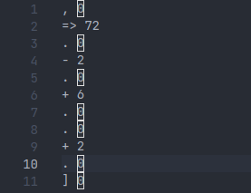

<div id="top"></div>

<!-- PROJECT LOGO -->
<br />
<div align="center">
  

  <h3 align="center">BrainFuck++</h3>

  <p align="center">
    A better version of Brainfuck
  </p>
</div>


<!-- TABLE OF CONTENTS -->
<details>
  <summary>Table of Contents</summary>
  <ol>
    <li>
      <a href="#about-the-project">About The Project</a>
      <ul>
        <li><a href="#built-with">Built With</a></li>
      </ul>
    </li>
    <li>
      <a href="#getting-started">Getting Started</a>
      <ul>
        <li><a href="#prerequisites">Prerequisites</a></li>
        <li><a href="#installation">Installation</a></li>
      </ul>
    </li>
    <li><a href="#usage">Usage</a></li>
    <li><a href="#roadmap">Roadmap</a></li>
    <li><a href="#contributing">Contributing</a></li>
    <li><a href="#license">License</a></li>
    <li><a href="#contact">Contact</a></li>
    <li><a href="#acknowledgments">Acknowledgments</a></li>
  </ol>
</details>


<!-- ABOUT THE PROJECT -->
## About



BrainFuck++ is a programmming language/compiler based on Brainfuck,
It is not meant to be used for real projects but it is more of a challenge.

BrainFuck++ is perfect if you are bored and want to create some fun programs

<p align="right">(<a href="#top">back to top</a>)</p>


### Built With

Brainfuck++ is built with plain python and NO lexer/parser modules or other compiler modules
BrainFuck is a little bloated since i wanted to learn how compilers work, i dont really need a lexer and parser since the language is so simple but i want to learn so that i can create more advanced compilers in the future.

<p align="right">(<a href="#top">back to top</a>)</p>


<!-- GETTING STARTED -->
## Getting Started

Here i will show you how to setup Brainfuck++ on any arch based linux distro

### Prerequisites

Install all the Prerequisites
* python
  ```sh
  sudo pacman -S python python-pip
  ```
* python modules
  ```sh
  sudo pip install os subprocess argparse
  ```
* gcc
  ```sh
  sudo pacman -S gcc
  ```

### Installation

1. Clone the repo
   ```sh
   git clone https://github.com/Proxin66/bf
   ```
   
2. Cd into the reop
   ```sh
   cd bf
   ```
   
3. Give program permission to execute
   ```sh
   chmod +x main.py
   ```

<p align="right">(<a href="#top">back to top</a>)</p>


<!-- USAGE EXAMPLES -->
## Usage

To Compile a brainfuck++ program Run this command when inside the bf directory
```sh
./main.py example.bf++
```

<p align="right">(<a href="#top">back to top</a>)</p>


<!-- SYNTAX -->
## Syntax

The syntax for Brainfuck++ looks like this
```
[KWORD] [ARGS]
```
### Keywords
```
> 0 : Increase memory pointer by the specified amount in [ARGS]
< 0 : Decrease memory pointer by the specified amount in [ARGS]
+ 0 : Increase value stored on pointer by the specified amount in [ARGS]
- 0 : Decrease value stored on pointer by the specified amount in [ARGS]
= 0 : Set the value stored on pointer to the specified value in [ARGS]
. 0 : Output value stored on pointer to stdout
, 0 : Set the stored value of the pointer to input from stdin
[ 0 : Loop until the value stored on the pointer is equals to the value specified in [ARGS]
] 0 : End if statements and loops
=> 0 : If the current value stored on the pointer is equals to the value specified in [ARGS] then run the code between if statement and End statement
!> 0 : If the current value stored on the pointer is not equals to the value specified in [ARGS] then run the code between if statement and End statement
!=> 0 : Else if the current vvalue stored on the pointer is equals to the value specified in [ARGS] then run the code between if statement and End statement
!!> 0 : Else if the current value stored on the pointer is not equals to the value specified in [ARGS] then run the code between if statement and End statement
```

## examples

### hello world
```
= 104
. 0

- 2
. 0

+ 6
. 0
. 0

+ 2
. 0

= 32
. 0

= 119
. 0

- 7
. 0

+ 2
. 0

- 5
. 0

- 7
. 0

= 10
. 0
```

<p align="right">(<a href="#top">back to top</a>)</p>


<!-- LICENSE -->
## License

Distributed under the MIT License. See `LICENSE.txt` for more information.

<p align="right">(<a href="#top">back to top</a>)</p>
